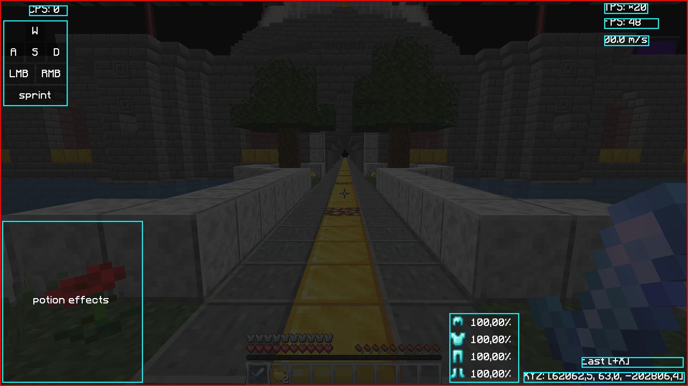
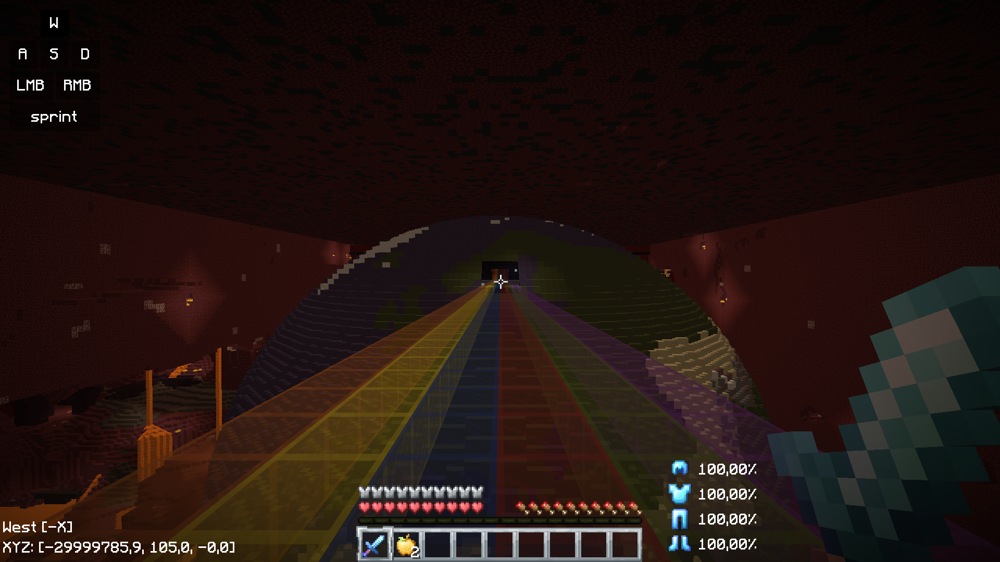

# Whim Client
- WhimClient is a simple 1.8.9 pvp client with Optifine

## Default Controls

|    key   | function                                            |
| -------- |-----------------------------------------------------|
| `h`      | HUD Menu (for toggling modules on/off)              |
| `j` | HUD Configuration (for changing modules' positions) |
| `z` | Freelook (if enabled in the HUD Menu)               |

- these controls can be remapped through settings

## Showcase

## Installation

1) building from source
    - either clone this repository, or download the latest release
    - make sure that java 1.8 is installed on your computer
    - run `./gradlew build`, you'll then find the generated jar in `build/libs`
    - download `WhimClient.json` from the latest release
    - from this point onwards, follow the instructions for downloading the compiled client from step n. 2
   

2) downloading the compiled client
    - to do this, you'll have to download `WhimClient.jar` and `WhimClient.json` from the latest release
    - you'll put these two files into a folder called `WhimClient`
    - then you'll locate your `.minecraft/versions` folder, and paste it in there
    - then launch Minecraft Launcher, make a new installation, select `release WhimClient`, and it's done!
  
- if you have trouble finding the `.minecraft/versions` folder, this is an overview of where it should be based on your OS

 

| OS | location |
|----|-----------|
| Windows | %APPDATA%\\.minecraft\versions |
| Linux | ~/.minecraft/versions |
| MacOS | ~/Library/Application Support/minecraft/versions |
