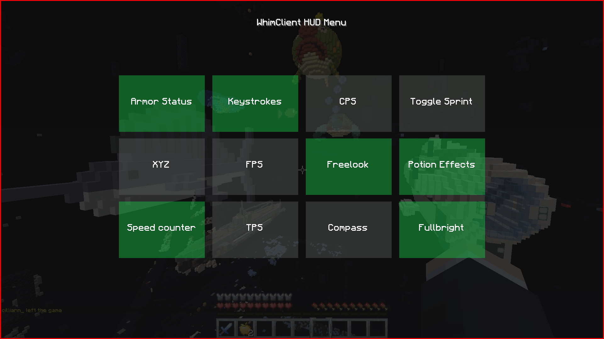

# Whim Client
- WhimClient is a simple 1.8.8 pvp client with Optifine

## Default Controls

|    key   | function |
| -------- | -------  |
| `h`      | HUD Menu (for toggling modules on/off) |
| `j` | HUD Configuration (for changing modules' positions) |

- these controls can be remapped through settings

## Showcase

